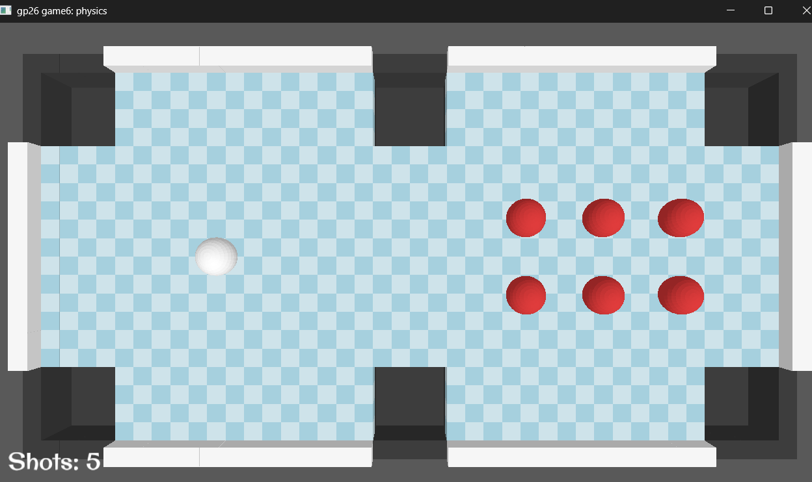

# "One Shot" Clearance

Author: Tao Jin

Design: Try to clear the table with available shots before the white ball stops.

Screen Shot:

How To Play:

When in playmode, use 'tab' to toggle between hit perspective, which is fixed, and free perspective; In hit perspective, hold left mouse key to aim, release it to hit the white ball. When aiming, a predict line will appear. The force to hit is proportional to the distance between the cursor and the white ball. Press space to time-stop and resume (to assist aim). Hits other than the first hit are allowed only before the white ball has stopped.

Sources: https://fonts.google.com/selection?lang=en_Latn&preview.script=Latn&preview.lang=en_Latn

## Extra Credit

Are your Physics Deterministic? If so, how can we verify this?

I don't have enough time to develop a replay system, and it also inteferes with some gameplay design;

Are your Physics Rewindable? If so, how can we verify this?

This game was built with [NEST](NEST.md).
